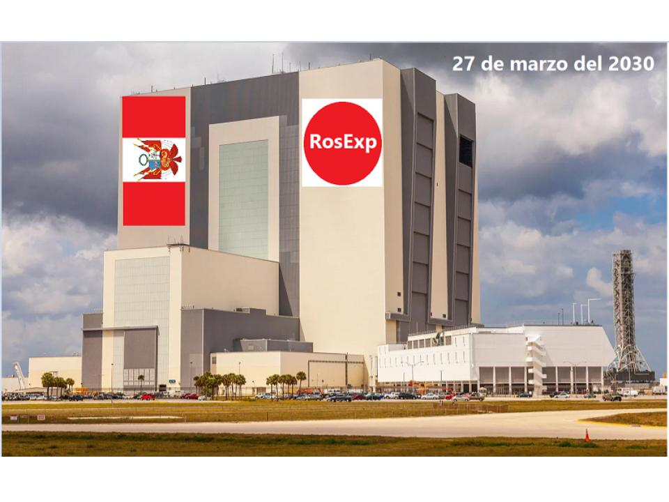
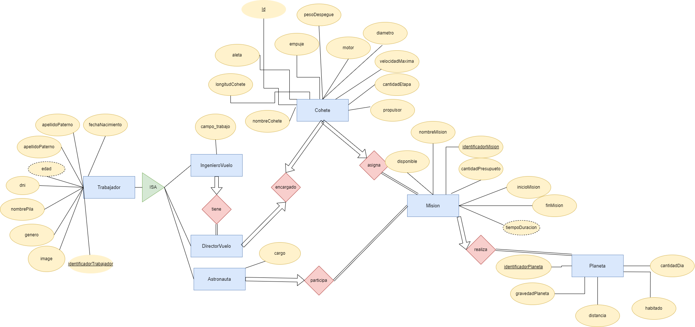

# Proyecto Final del Curso de Desarrollo Basado en Plataformas

## Descripción

En el proyecto final de este curso, nuestro equipo ha desarrollado un sistema de aplicación web que cumple con los principios de desarrollo basado en plataformas. El sistema está compuesto por al menos dos frontends distintos y un backend que conecta ambas interfaces. Este proyecto tiene como objetivo aplicar los conceptos y habilidades adquiridas a lo largo del curso en un escenario práctico y completo.

## Requisitos del Proyecto

1. **Deployment:**
   - La aplicación se despliega correctamente en [Heroku](https://www.heroku.com/), [AWS](https://aws.amazon.com/), [PythonAnywhere](https://www.pythonanywhere.com/) o algún otro servicio cloud.

2. **Stateless/Stateful:**
   - La aplicación web permite el registro y autenticación de usuarios.
   - Una vez que un usuario se ha autenticado, la aplicación recuerda al usuario logueado hasta que ocurre el logout.

3. **Uniform Interface:**
   - La aplicación permite realizar operaciones de Crear, Leer, Actualizar y Eliminar (CRUD) en objetos o registros relevantes para su aplicación.

4. **Code On Demand:**
   - El cliente de la aplicación implementa lógica y llamadas asíncronas al servidor para llevar a cabo las operaciones de CRUD en las entidades.

5. **Layered:**
   - Las entidades o información relevante de la aplicación son almacenadas y recuperadas mediante una capa de persistencia que utiliza un sistema de gestión de base de datos. **Observación:** La aplicación debe contener al menos 5 recursos (entidades).

## Estructura de la Presentación

- **Nombre del Proyecto:** RosExp

- **Integrantes:**

Nombre               | Email           | Github
-------------------- | ---------------- | ----------------
Gian Marco, Arteaga Álvarez |gian.arteaga@utec.edu.pe | 2030Gian
Mateo, Espinoza Monti | mateo.espinoza@utec.edu.pe | CTMDOVZ
Enzo Sebastian, Gomez Villegas | enzo.gomez@utec.edu.pe | enzoutec
Fátima Margarita, Villón Zárate | fatima.villon@utec.edu.pe | fatimavillon

- **Introducción:** 
Para el año 2026, la empresa aeroespacial peruana RosExp iniciará un proyecto llamado Mars2030, el cual tiene como objetivo llevar a los humanos al planeta Marte. Cada vez, la tecnología avanza a pasos muy acelerados. La probabilidad de extinguirnos nosotros mismos cuando ocurra una tercera guerra mundial con bombas nucleares es muy alta. La reciente guerra entre Rusia y Ucrania nos muestra cómo es que se podrían producir estos enfrentamientos. Por otro lado, está el crecimiento poblacional mundial que crece a una tasa acelerada en comparación a siglos anteriores. Las **Naciones Unidas** nos muestra que la población mundial es más de tres veces mayor que a mediados del siglo XX. Esto nos indica que en un futuro, la Tierra será un lugar muy codiciado y podríamos volver al primer problema de desatar una guerra por tierra y agua. 

## Modelo Entidad Relación

### Paso 00: Definición del recurso

* Implementaremos una API para una empresa aereoespacial. Tendremos 4 recursos: Cohete, Mision, Planeta y Trabajador que puede ser Astronauta, Director de Vuelo y Ingeniero de Vuelo.

#### [Cohete]

|Atributo|Tipo de dato|Descripción|
|---------|----|-----------|
|id|Long|Identificador único autogenerado| 
|nombreCohete|String|Nombre Cohete| 
|empujeCohete|Double|Cantidad en toneladas del empuje del cohete|
|longitudCohete|Double|El tamaño por largo del cohete en metros|
|pesoDespegue|Double|El peso en toneladas con el cual el cohete despegua de la la superficie de la Tierra en|
|motor|String|El motros del cohete|
|diametro|Double|Es el diametro del cohete(ancho del cohete) en metros (m)|
|velocidadMaxima|Double|Rapidez máxima del cohete en kilometros por hora (km/h)| 
|cantidadEtapa|Integer|Nos da información de la cantidad de etapas que tiene el cohete|
|propulsor|Boolean|Nos informa si el cohete tiene o no propulsores.|
|aleta|Boolean|Nos da información si el cohete tiene o no aletas.|

#### [Misión]

|Atributo|Tipo de dato|Descripción|
|---------|----|-----------|
|identificadorMision|Long|Identificador único autogenerado para una misión|
|disponible|Boolea|Indica si la misión está disponible o no|
|cantidadPresupuesto|Double|La cantidad de presupuesto que ha tenido la misión|
|nombreMision|String|El nombre de la misión|
|inicioMision|Date|Fecha de inicio de la misión|
|finMisión|Date|Fecha fin de la misión|
|tiempoDuracion|Integer|Cantidad de días que duró la misión. Es un atributo derivado que se calcula de inicioMision y FinMision|

#### [Planeta]

|Atributo|Tipo de dato|Descripción|
|---------|----|-----------|
|id|Long|Identificador único autogenerado|
|nombrePlaneta|String|Nombre del planeta|
|gravedadPlaneta|Double|Muestra la gravedad asociada al planeta|
|cantidadDia|Integer|Muestra la cantidad de días que dura un año en el planeta|
|distancia|Double|Muestra la cantidad de distancia desde la Tierrra al plantena en kilómetros (Km)|
|habitado|Boolean|Es verdadero o falso e indica si está o no habitado el planeta|

#### [Trabajador]

|Atributo|Tipo de dato|Descripción|
|---------|----|-----------|
|id|Long|Identificador único autogenerado|
|dni|String|Identificador único del trabajor|
|apellido_paterno|String|Apellido paterno|
|apellido_materno|String|Apellido materno|
|nombre_pila|String|Nombre de pila|
|imagen|String|URL o ruta de la imagen de la persona|
|genero|String|Genero del trabajador|
|fecha_nacimiento|Date|Fecha de nacimiento|
|edad|Integer|Edad actual, atributo derivado de fecha_nacimiento|

##### [Astronauta]

|Atributo|Tipo de dato|Descripción|
|---------|----|-----------|
|id|Long|Identificador único autogenerado|
|dni|String|Identificador único del trabajor|
|apellidoPaterno|String|Apellido paterno|
|apellidoMaterno|String|Apellido materno|
|nombrePila|String|Nombre de pila|
|imagen|String|URL o ruta de la imagen de la persona|
|genero|String|Genero del trabajador|
|fechaNacimiento|Date|Fecha de nacimiento|
|edad|Integer|Edad actual, atributo derivado de fecha_nacimiento|
|cargo|String|Nos da información sobre el cargo que desempeña el astronauta en una misión|

##### [DirectorVuelo]

|Atributo|Tipo de dato|Descripción|
|---------|----|-----------|
|id|Long|Identificador único autogenerado|
|dni|String|Identificador único del trabajor|
|apellido_paterno|String|Apellido paterno|
|apellido_materno|String|Apellido materno|
|nombre_pila|String|Nombre de pila|
|imagen|String|URL o ruta de la imagen de la persona|
|genero|String|Genero del trabajador|
|fecha_nacimiento|Date|Fecha de nacimiento|
|edad|Integer|Edad actual, atributo derivado de fecha_nacimiento|

##### [IngenieroVuelo]

|Atributo|Tipo de dato|Descripción|
|---------|----|-----------|
|id|Long|Identificador único autogenerado|
|dni|String|Identificador único del trabajor|
|apellido_paterno|String|Apellido paterno|
|apellido_materno|String|Apellido materno|
|nombre_pila|String|Nombre de pila|
|imagen|String|URL o ruta de la imagen de la persona|
|genero|String|Genero del trabajador|
|fecha_nacimiento|Date|Fecha de nacimiento|
|edad|Integer|Edad actual, atributo derivado de fecha_nacimiento|
|campoTrabajo|String|Indica el campo al cual se dedica el ingeniero de vuelo cuando se realiza el despegue del cohete|

- **Demostración en Vivo:** [Descripción de la demostración en vivo de las principales funcionalidades de la aplicación]
- **Explicación del Diseño:** [Explicación del diseño general de la solución y resalte de las partes más importantes del código implementado]
- **Conclusiones y Aprendizajes:** [Enumeración de las conclusiones más importantes y su relación con los conceptos del curso]
- **Preguntas:** [Respuestas a las posibles preguntas del jurado sobre el proyecto y su desarrollo]

## Requisitos Adicionales

- Los grupos deben estar compuestos por un mínimo de 3 alumnos y un máximo de 4.
- Se han seguido las mejores prácticas de desarrollo y documentación de código.
- La presentación del proyecto es clara y profesional, utilizando herramientas adecuadas para la exposición.

Este proyecto final es una oportunidad para demostrar nuestras habilidades en el desarrollo basado en plataformas y nuestra capacidad para diseñar y construir una aplicación web funcional que cumple con los principios y requisitos establecidos. ¡Buena suerte en el desarrollo y presentación!

## Mision 

---
{
    "nombreMision" : "RosExp 2032",
    "inicioMision" : "2032-10-28T00:00:00.000+00:00",
    "finMision" : "2035-10-28T00:00:00.000+00:00",
    "disponible" : true,
    "cantidadPresupuesto": 1500000000,
    "tiempoDuracion": 730

}

{
    "nombreMision" : "Mars 2030",
    "inicioMision" : "2033-03-27T00:00:00.000+00:00",
    "finMision" : "2038-03-27T00:00:00.000+00:00",
    "disponible" : true,
    "cantidadPresupuesto": 1500000000,
    "tiempoDuracion": 1825

}
---

## Astronautas
---
{
    "dni": "21005918",
    "apellidoPaterno" : "Alvarez",
    "apellidoMaterno" : "Caisahuana",
    "nombrePila": "Rosa",
    "imagen" : "https://facebook/user/21005918",
    "genero": "Femenino",
    "fechaNacimiento":"1971-08-28T00:00:00.000+00:00",
    "edad":52,
    "cargo" : "Mecanica de los cohetes"
}

{
    "dni": "74410344",
    "apellidoPaterno" : "Arteaga",
    "apellidoMaterno" : "Alvarez",
    "nombrePila": "Gian Marco",
    "imagen" : "https://facebook/user/74410344",
    "genero": "Masculino",
    "fechaNacimiento":"2002-03-27T00:00:00.000+00:00",
    "edad":21,
    "cargo" : "Comandante"
}

---

## IngenieroVuelo
---

{
    "dni": "74410342",
    "apellidoPaterno" : "Hinostroza",
    "apellidoMaterno" : "Alvarez",
    "nombrePila": "Angela",
    "imagen" : "https://facebook/user/74410342",
    "genero": "Femenino",
    "fechaNacimiento":"1998-08-13T00:00:00.000+00:00",
    "edad":25,
    "campoTrabajo" : "Biologia"
}

{
    "dni": "74410343",
    "apellidoPaterno" : "Hinostroza",
    "apellidoMaterno" : "Alvarez",
    "nombrePila": "Pamela",
    "imagen" : "https://facebook/user/74410343",
    "genero": "Femenino",
    "fechaNacimiento":"1998-08-13T00:00:00.000+00:00",
    "edad":25,
    "campoTrabajo" : "Igeniera Agronoma"
}

---
## DirectorVuelo
---
{
    "dni": "42343243",
    "apellidoPaterno" : "Cristobal",
    "apellidoMaterno" : "Alvarez",
    "nombrePila": "Jimi Maicol",
    "imagen" : "https://facebook/user/42343243",
    "genero": "Masculino",
    "fechaNacimiento":"2000-05-04T00:00:00.000+00:00",
    "edad":23
}

---

## Cohete

---
{
	"nombreCohete" : "Starship",
	"empujeCohete" : 7500,
	"longitudCohete" : 120,
	"pesoDespegue" : 4000,
	"motor" : "Raptor",
	"diametro" : 9,
	"velocidadMaxima" :1000,
	"cantidadEtapa" : 3,
	"propulsor" : true,
	"aleta" : false

}

{
	"nombreCohete" : "Dragon",
	"empujeCohete" : 8500,
	"longitudCohete" : 100,
	"pesoDespegue" : 1000,
	"motor" : "Raptor",
	"diametro" : 9,
	"velocidadMaxima" :44256,
	"cantidadEtapa" : 3,
	"propulsor" : true,
	"aleta" : true

}

{
	"nombreCohete" : "Falcon",
	"empujeCohete" : 9500,
	"longitudCohete" : 98,
	"pesoDespegue" : 2000,
	"motor" : "RosExp",
	"diametro" : 9,
	"velocidadMaxima" :55000,
	"cantidadEtapa" : 2,
	"propulsor" : true,
	"aleta" : true

}
---

## Entrega Parcial
> En la entrega parcial del proyecto (semana 11), debe realizar una entrega parcial del proyecto. Esta deberá contener las siguientes características.
1. **Backend**
   - Debe de contener las 3 primeras entidades construidas.
   - La capa de seguridad debe de estar implementada.
   - El *API* debe de estar deployeada correctamente.
2. **Frontend**
   - El usuario debe de poder loguearse en la aplicación.
   - El usuario debe de poder visualizar la pantalla principal (de inicio) de la aplicación.
3. **Entregable**
   - Codigo fuente de `1` y `2`.
   - Informe pdf (revisar detalles en la rúbrica).
   - Demo (video).
